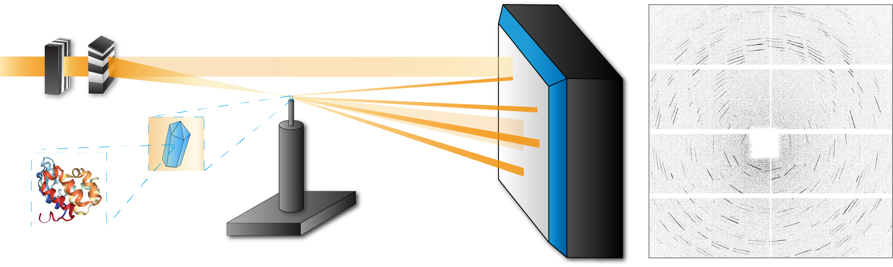

.. cbclib documentation master file.
   You can adapt this file completely to your liking, but it should at least
   contain the root `toctree` directive.

|

**C**\ onvergent **B**\ eam **C**\ rystallography **lib**\ rary (`cbclib in GitHub <https://github.com/simply-nicky/cbclib>`_)
is data processing tool for convergent beam X-ray crystallography experiments. It covers the tasks of patterns pre-processing,
diffraction streak detection, preliminary indexing of CBC patterns, lattice and scattering geometry refinement, and intensity
scaling and merging.

The library is written in Python 3 and uses a C back-end integrated into Python framework with `Cython <https://cython.org>`_.
Most of the computationally intensive routines are written in C and employ concurrent calculations with the help of `OpenMP library <https://www.openmp.org>`_.

**cbclib** includes a framework to work with CXI files, see :doc:`reference/cxi_ref` for more information.

Python Reference
================

.. toctree::
    :maxdepth: 1

    install
    reference/cbclib_api

Indices and tables
==================

* :ref:`genindex`
* :ref:`modindex`
* :ref:`search`