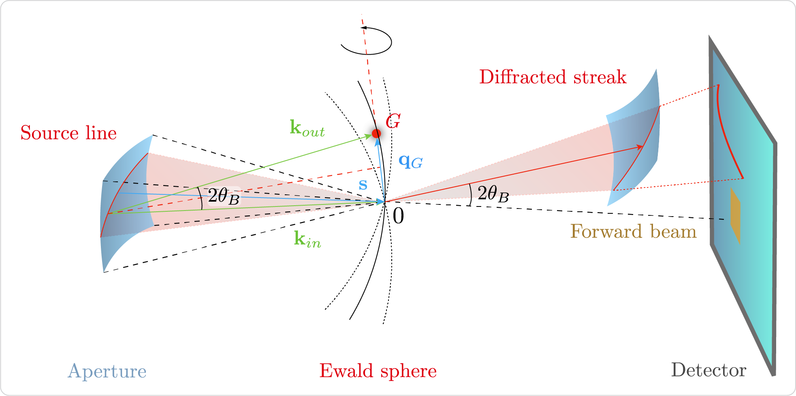

.. cbclib documentation master file.
   You can adapt this file completely to your liking, but it should at least
   contain the root `toctree` directive.

******
cbclib
******

|

Python library for data processing of Convergent Beam Crystallography (CBC) datasets.

Python Reference
================

.. toctree::
    :maxdepth: 1

    install
    reference/cbclib_api

Indices and tables
==================

* :ref:`genindex`
* :ref:`modindex`
* :ref:`search`