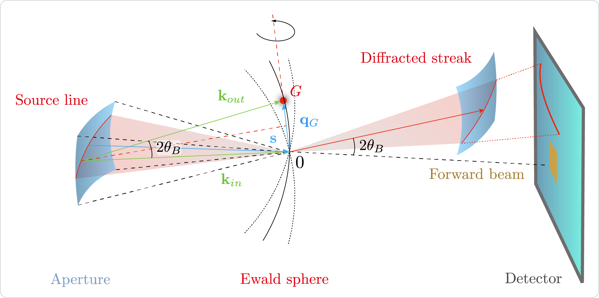

CBD forward model
=================

Experimental setup
------------------

.. image:: ../_static/cbclib_scan_setup.png
    :width: 100 %
    :alt: Experimental setup of a convergent beam crystallography experiment.

In the experimental setup of a CBC experiment a pair of lenses focuses the X-ray beam into a point and a crystalline sample is put in the X-ray beam at a ceratin
distance downstream. The sample diffracts the incoming X-ray beam into a diffraction pattern captured by the detector. The experimental geometry is stored in
:class:`cbclib.ScanSetup` container, which comprises the following parameters:

* **foc_pos** : Focal point of the incoming X-ray beam.
* **pupil_roi** : Focus beam extent :code:`[y_min, y_max, x_min, x_max]` at the detector plane. Since the beam is formed by two 1D focusing lenses, the focused
  beam has a rectangular shape. 
* **rot_axis** : The axis of sample rotation. The axis is defined by its azimuth and inclination.
* **smp_dist** : Focus-to-sample distance in meters.
* **wavelength** : The wavelength of the incident X-ray beam in meters.
* **x_pixel_size** and **y_pixel_size** : Detector pixel size along the x and y axes in meters.

.. note::

    All coordinates are defined relative to the origin of the detector and z axis is directed collinearly with the direction of X-ray beam propagation.

A location at the detector plane is related to a wave-field emanated from the source point :math:`\mathbf{x}_s`` inside the sample and scattered along the
:math:`\mathbf{k}_{out}`` wave-vector as follows:

.. math::

    \mathbf{k}_{out} &= 
        \begin{cases}
            \sin \theta(\mathbf{x} - \mathbf{x}_s) \cos \varphi(\mathbf{x} - \mathbf{x}_s), \\
            \sin \theta(\mathbf{x} - \mathbf{x}_s) \sin \varphi(\mathbf{x} - \mathbf{x}_s), \\
            \cos \theta(\mathbf{x} - \mathbf{x}_s),
        \end{cases} \\
    \theta(\mathbf{x}) &= \arccos \left(\frac{z}{\sqrt{x^2 + y^2 + z^2}} \right), \\
    \varphi(\mathbf{x}) &= \mathrm{atan2}(y, x).

.. seealso:: 

    :class:`cbclib.ScanSetup` provides methods to project a detector point to a outcoming wave-vector (:func:`detector_to_kout <cbclib.ScanSetup.detector_to_kout>`)
    and vice-versa (:func:`kout_to_detector <cbclib.ScanSetup.kout_to_detector>`) following the above equation.

The source point :math:`\mathbf{x}_s` is assumed to lie at the sample plane and can be expressed as a function of the incoming wave-vector :math:`\mathbf{k}_{in}`:

.. math::

    \mathbf{x}_s = 
        \begin{cases}
            x_f + (z_{smp} - z_f) \tan \theta(\mathbf{k}_{in}) \cos \varphi(\mathbf{k}_{in}), \\
            y_f + (z_{smp} - z_f) \tan \theta(\mathbf{k}_{in}) \sin \varphi(\mathbf{k}_{in}), \\
            z_{smp}.
        \end{cases}

.. seealso:: 

    The above equation is used in :func:`cbclib.ScanSetup.kin_to_sample` to project an incident wave-vector to a source point at the sample plane.

:class:`CBDModel <cbclib.CBDModel>`
-----------------------------------

The forward model :class:`cbclib.CBDModel` takes the following objects:

* **Basis** : Reciprocal lattice unit cell vectors (:class:`cbclib.Basis`).
* **Sample** : Sample's position and orientation (:class:`cbclib.Sample`).
* **Setup** : Experimental setup (:class:`cbclib.ScanSetup`).

:class:`cbclib.CBDModel` finds all the coordinates on the detector that satisfy the Bragg condition for reflection (see :func:`generate_streaks <cbclib.CBDModel.generate_streaks>`)
and calculates the standard reflection profile :math:`f^2_{hkl}(\mathbf{x})` (see :func:`pattern_dataframe <cbclib.CBDModel.pattern_dataframe>`). The location of a
reflection on the detector is defined by a set of incident wave-vectors that satisfy the Bragg condition. These incident wave-vectors are given by:

.. math::

    (\mathbf{k}_{in} - \mathbf{s}) \mathbf{q} = 0, \quad \mathbf{s} = 
    \begin{cases}
        \sin\left(\arccos(q / 2) - \theta_q\right) \cos \varphi_q, \\
        \sin\left(\arccos(q / 2) - \theta_q\right) \sin \varphi_q, \\
        \cos\left(\arccos(q / 2) - \theta_q\right).
    \end{cases}

.. seealso:: 

    :func:`cbclib.bin.calc_source_lines` takes a set of reciprocal lattice points and calculates the source lines following the above equation.

Contents
--------

.. toctree::
    :maxdepth: 1

    classes/scan_setup
    classes/basis
    classes/rotation
    classes/sample
    classes/streaks
    classes/cbd_model
