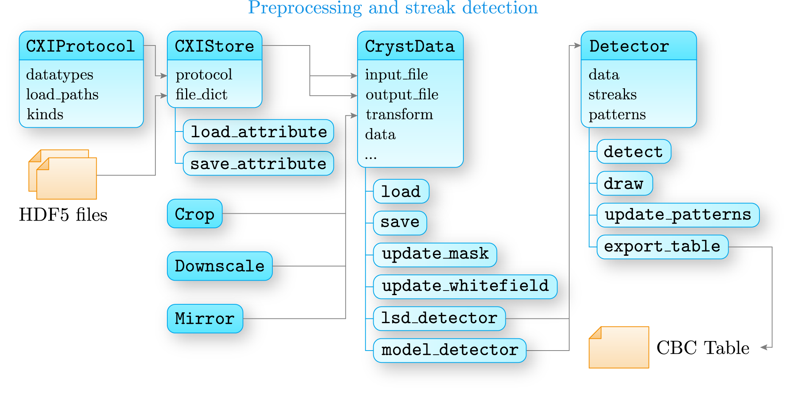

Preprocessing and streak detection
==================================

The following classes are central to the processing of CBC datasets:

* **CrystData** : :class:`cbclib.CrystData` is the main detector data container, which provides an interface for the preprocessing of
  sets of measured CBD patterns. It also provides a method to return a streak detector.
* **LSDetector** : :class:`cbclib.LSDetector` is a streak detector, based on the Line Segment Detection [LSD]_ algorithm. The detector
  class provides an interface to perform the LSD detection and to create a normalised and sparse CBD pattern image.
  The results are then can be exported as a CBC table (:class:`cbclib.CBCTable`) used for the setup and lattice refinement.
* **ModelDetector** : After the corect experimental geometry and sample lattice are obtained, one can detect the diffraction streaks by using
  the forward modelling of CBC patterns with :class:`cbclib.ModelDetector`. The forward modelling also asigns the Miller
  indices to the detected diffraction streaks. The results are then can be exported as a CBC table (:class:`cbclib.CBCTable`)
  used for CBC intensity scaling.

:class:`CrystData <cbclib.CrystData>`
-------------------------------------

:class:`cbclib.CrystData` contains an interface to load, save, and edit data pertained to a CBC dataset to and from the HDF5
files. Also It contains various utilities that are necessary to conduct an initial white-field and background generation,
background subtraction, and bad pixel masking:

* :func:`cbclib.CrystData.save` and :func:`cbclib.CrystData.load` use an :attr:`cbclib.CrystData.input_file` file handler to
  load and save data to HDF5 files.
* :func:`cbclib.CrystData.mask_frames`, :func:`cbclib.CrystData.mask_pupil`, :func:`cbclib.CrystData.update_mask` allow one to mask
  out certain frames, regions of an image, and bad pixels, respectively.
* :func:`cbclib.CrystData.import_whitefield` and :func:`cbclib.CrystData.update_whitefield` add or generate a white-field used
  for background generation and background subtraction.
* :func:`cbclib.CrystData.lsd_detector` and :func:`cbclib.CrystData.model_detector` return a streak detector based on LSD
  algorithm (:class:`cbclib.bin.LSD`) and CBD prediction (:class:`cbclib.CBDModel`), respectively.

:class:`LSDetector <cbclib.LSDetector>`
---------------------------------------

:class:`cbclib.LSDetector` uses the background subtracted patterns to create a sparse and normalised representation.
:class:`cbclib.LSDetector` contains a :class:`cbclib.bin.LSD` detector capable of performing the robust streak detection with
the [LSD]_ algorithm. The detection algorithm comprises three stages:

1. Initial LSD detection, that pixel-wise clustering of gradient mapping. The qradient mapping is quantised with a :attr:`cbclib.bin.LSD.quant`
   step. The pixel gradients incur clusterring if the gradient directions are not more than :attr:`cbclib.bin.LSD.ang_th` apart.
2. The adjacent lines are grouped into pairs, then the pairs are collapsed into a single line as follows:

   a. Each line in the pair is rasterised by the dint of :func:`cbclib.bin.draw_line_image` method that uses Bresenham's algorithm [BSH]_.
   b. A union of rasterised image traces is used to calculate the image moments. An average line direction and line coordinates are
      then calculated based on the image moments.
   c. A new collapsed line overwrites a pair of lines if the intersection-to-union ratio of a rasterised image of the collapsed line
      and the pair of lines is above the ``group_threshold``.

3. The lines with a zero-th image moment below the ``filter_threshold`` are discarded.

:class:`ModelDetector <cbclib.ModelDetector>`
---------------------------------------------
:class:`cbclib.ModelDetector` takes the refined crystal lattice (:class:`cbclib.Basis`), sample parameters (:class:`cbclib.ScanSamples`),
and experimental geometry (:class:`cbclib.ScanSetup`) to model the locations of Bragg reflection on the detector. The predicted
reflection is presumed to be present in the measured patterns if the signal-to-noise ratio is above the threshold (see
:func:`cbclib.ModelDetector.detect`).

.. note::

    After obtaining a set of detected streaks, both :class:`cbclib.LSDetector` and :class:`cbclib.ModelDetector` can generate the normalised
    sparse patterns with a two-zone masking method (see :class:`cbclib.bin.normalise_pattern`). At the end, the sparse CBC patterns can
    be exported to a :class:`CBC table <cbclib.CBCTable>` with :func:`cbclib.LSDetector.export_table` or :func:`cbclib.ModelDetector.export_table`.

Contents
--------

.. toctree::
    :maxdepth: 1

    classes/cryst_data
    classes/lsd
    classes/lsdetector
    classes/model_detector
