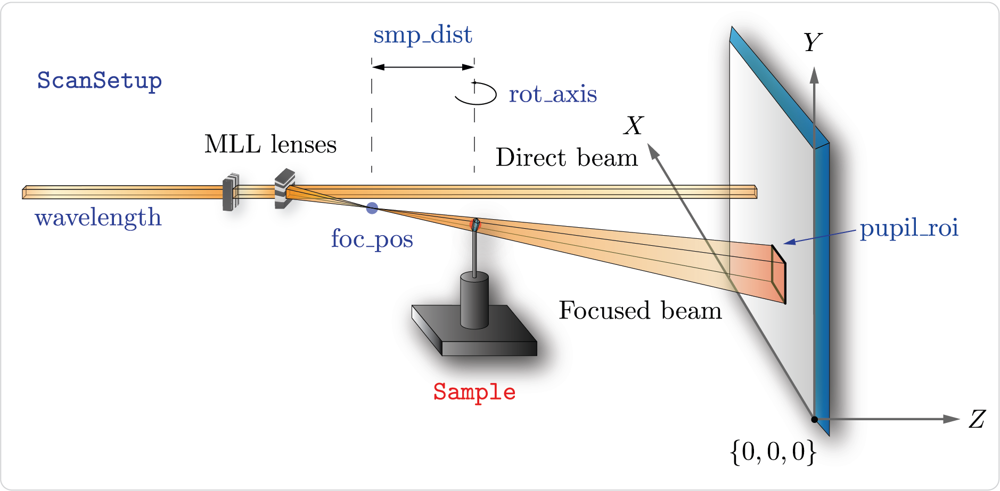

Experimental geometry and pattern prediction
============================================

In the experimental setup of a CBC experiment a pair of lenses focuses the X-ray beam into a point and a crystalline sample is put in the X-ray beam at a ceratin
distance downstream. The sample diffracts the incoming X-ray beam into a diffraction pattern captured by the detector. The structure of a CBC pattern depends on
the following parameters:

* foc_pos : Focal point of the incoming X-ray beam.
* position : Sample's position.
* pupil_min, pupil_max : Focus beam extent measured at the detector. Since the beam is formed by two 1D focusing lenses, the focused beam has a rectangular shape.

Contents
--------

.. toctree::
    :maxdepth: 1

    classes/scan_setup
    classes/basis
    classes/rotation
    classes/sample
    classes/streaks
    classes/cbd_model
