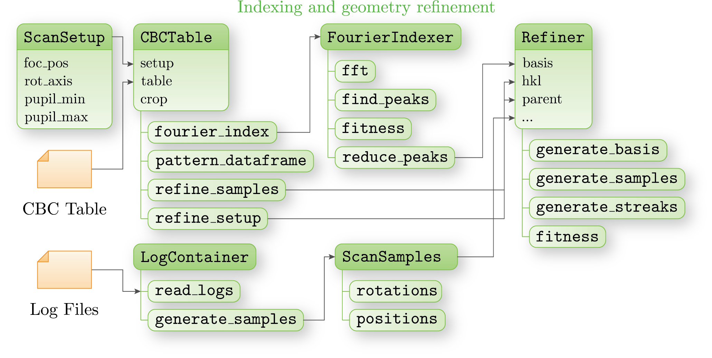

Indexing and sample refinement
==============================

In order to start performing the indexing of CBD diffraction data, one needs a CBC table generated from the
streak detection results (:func:`cbclib.LSDetector.export_table`) and a resolved experimental geometry (see
:doc:`exp_geom` for more info). The following classes are central to the indexing and sample refinement of
CBC datasets:

* :class:`cbclib.CBCTable` is the main data container for CBC tables. It provides an interface to output any
  specific CBC patterns in the scan in different formats. Besides, it contains a set of methods to perform
  the indexing and sample refinement procedure.
* :class:`cbclib.Map3D` is the 3D data container used for the Fourier auto-indexing. It stores the measured
  signal in reciprocal space in a rasterised manner and provides a set of utility functions, that supplement
  the auto-indexing algorithm.
* :class:`cbclib.SampleProblem` is the sample refinement problem. It employs :class:`cbclib.CBDModel` CBD
  pattern prediction to find sample position and alignment, that yields the best fit with the experimentally
  measured pattern. The criterion calculates the marginal log-likelihood, that the experimentally measured
  pattern corresponds to the predicted one.

Contents
--------

.. toctree::
    :maxdepth: 1

    classes/cbc_table
    classes/map_3d
    classes/sample_problem
    classes/scan_samples
